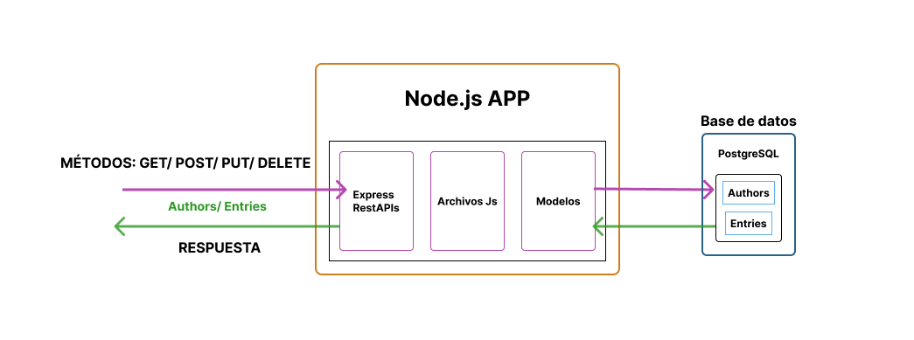

# SQL-Api
Api rest with PostgreSQL + Express
Welcome! This README file will provide you with an overview of the API, its features, how to use it, and other important information.
<br>
<br>

## API structure
This rest api is created on node.js with express (server), javascript files with business logic, models for data access control, databases with postgreSQL (relational database)
<br>

[](/README.md)
<br>
<br>

## API Base URL
The base URL's for accessing the API are: http://localhost:3000/api/authors and http://localhost:3000/api/entries
<br>
<br>

### Introduction

The SQL-Api is an API for managing a collection of authors and entries. It provides endpoints to retrieve, search, create, update, and delete them.
<br>
<br>

### Getting Started
Prerequisites
To use this API, you will need:

  1. Ensure that you have a local development environment set up with Node.js and npm installed.
  2. Make sure you have an API key for authentication purposes. 
  3. TEST_API_KEY=dh1t9cv27
<br>
<br>

### Installation:

  1. Clone the SQL-Api repository to your local machine.
  2. Navigate to the project directory.
  3. Run the following command to install the dependencies:
<br>

```
npm install
```
<br>

### Configuration:

  - Open the project directory and locate the .env file.
  - Replace YOUR_API_KEY in the .env file with your actual API key.
  - Save the changes

### Starting the API:

In the project directory, run the following command to start the API server:
<br>
```
npm run dev
```
<br>
The API will be accessible at http://localhost:3000/api/authors and http://localhost:3000/api/entries.
<br>
<br>

### Using the API:

  - You can send HTTP requests to the API using tools like cURL, Postman, or any programming language's HTTP library.
  - Refer to the provided endpoints in the API's README file for the available routes and their functionalities.
  - Use the appropriate HTTP methods (GET, POST, PUT, DELETE) and URLs to interact with the API.
  - Include your API key in the request URL for authentication when necessary.

### Examples routes:
<br>

#### To manage Authors:

1. To get information about one author with the email , send a GET request to 
  ```
  http://localhost:3000/api/authors?email=user@email.com
  ```
<br>

2. To search for all authors, send a GET request to
  ```
  http://localhost:3000/api/authors
  ```
<br>

3. To create a new author, send a POST request to 
```
http://localhost:3000/api/authors?API_KEY=YOUR_API_KEY
```
<br>

4. To update an existing author, send a PUT request to 
```
http://localhost:3000/api/authors?API_KEY=YOUR_API_KEY
```
<br>

5. To delete an author, send a DELETE request to 

```
http://localhost:3000/api/authors?API_KEY=YOUR_API_KEY.
```
___
<br>
<br>

#### To manage Entries:

1. To get information about entries of one author with the email , send a GET request to 
  ```
  http://localhost:3000/api/entries?email=user@email.com
  ```
<br>

2. To search for all entries, send a GET request to
  ```
  http://localhost:3000/api/entries
  ```
<br>

3. To create a new entry, send a POST request to 
```
http://localhost:3000/api/entries?API_KEY=YOUR_API_KEY
```
<br>

4. To update an existing entry, send a PUT request to 
```
http://localhost:3000/api/entries?API_KEY=YOUR_API_KEY
```
<br>

5. To delete an entry, send a DELETE request to 

```
http://localhost:3000/api/entries?API_KEY=YOUR_API_KEY.
```
___
<br>
<br>

Remember to replace YOUR_API_KEY with your actual API key in the request URLs that require authentication.
<br>
That's it!, Happy Coding!!!.
<br>
<br>
___

<br>

[](https://www.gromarant.com/)
<br>

[&copy; Mariangelica Rodriguez](https://www.linkedin.com/in/mariangelica-rodr%C3%ADguez-p%C3%A9rez/)